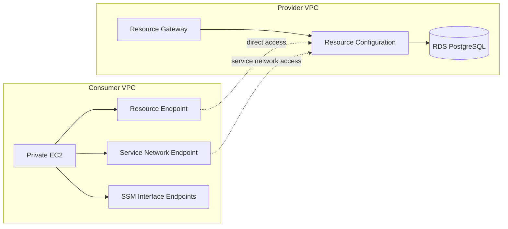

# CloudFormation Templates for AWS VPC Lattice Resource Access

提供側 VPC に配置した Amazon RDS for PostgreSQL を、AWS VPC Lattice を使って利用側 VPC から安全に参照するための CloudFormation テンプレート集です。

このリポジトリでは、以下の構成をまとめて構築できます。

- 提供側 VPC に RDS、Resource Gateway、Resource Configuration を作成
- 利用側 VPC に Resource Endpoint または Service Network Endpoint を作成
- 利用側 VPC にプライベート EC2 を作成
- Systems Manager Session Manager 接続用の VPC Endpoint を追加

## Overview

このテンプレート群は、データベースを持つ提供側ネットワークと、アプリケーションや運用端末を持つ利用側ネットワークを分離したサンプル構成です。

- Provider side
  - Amazon RDS for PostgreSQL
  - AWS VPC Lattice Resource Gateway
  - AWS VPC Lattice Resource Configuration
- Consumer side
  - Private Subnet
  - VPC Lattice Endpoint
  - Private EC2
  - SSM Interface VPC Endpoints

## Architecture



## Supported Patterns

このテンプレート群では、利用側 VPC から提供側リソースへ接続する方法を 2 パターン用意しています。

### 1. Resource Endpoint Pattern

Resource Configuration に対して、利用側 VPC から直接 Resource Endpoint を使って接続します。

### 2. Service Network Pattern

Resource Configuration を Service Network に関連付け、利用側 VPC から Service Network Endpoint 経由で接続します。

## Templates

| Template | Purpose | Main Dependencies |
| --- | --- | --- |
| CreateRG-NetWork.yaml | 提供側 VPC、RDS、Resource Gateway、Resource Configuration を作成 | なし |
| CreateCS-ResourceEndpoint.yaml | 利用側 VPC と Resource Endpoint を作成 | CreateRG-NetWork.yaml の ResourceConfigARN |
| CreateCS-ServiceNetWork.yaml | 利用側 VPC、Service Network、Service Network Endpoint を作成 | CreateRG-NetWork.yaml の ResourceConfigID |
| CreateCS-PrivateEC2.yaml | 利用側 VPC のプライベート EC2 を作成 | 利用側ネットワークスタックの Subnet / Security Group |
| Create_SSMEndpoint.yaml | Session Manager 用 VPC Endpoint を作成 | 利用側ネットワークスタックの VPC / Subnet / CIDR |

## Deployment Order

### Resource Endpoint Pattern

1. CreateRG-NetWork.yaml
2. CreateCS-ResourceEndpoint.yaml
3. CreateCS-PrivateEC2.yaml
4. Create_SSMEndpoint.yaml

### Service Network Pattern

1. CreateRG-NetWork.yaml
2. CreateCS-ServiceNetWork.yaml
3. CreateCS-PrivateEC2.yaml
4. Create_SSMEndpoint.yaml

CreateCS-PrivateEC2.yaml と Create_SSMEndpoint.yaml の MyNetworkStackName には、利用側ネットワークスタック名を指定してください。

- Resource Endpoint Pattern: CS-ResourceEndpoint など
- Service Network Pattern: CS-ServiceNetwork など

## Prerequisites

デプロイ前に以下を確認してください。

- 利用リージョンは ap-northeast-1 を前提としています
- SSM Parameter Store に MyKMSKeyID が存在すること
- EC2 用 IAM Instance Profile として EC2Instance_Role が存在すること
- CreateCS-PrivateEC2.yaml の AMI ID が対象リージョンで有効であること
- AWS VPC Lattice、RDS、VPC Endpoint を作成できる IAM 権限があること

## Stack Details

### CreateRG-NetWork.yaml

提供側 VPC を構築する基盤スタックです。

作成リソース:

- VPC
- 2 つのプライベートサブネット
- 2 つのプライベートルートテーブル
- Resource Gateway 用 Security Group
- RDS 用 Security Group
- RDS DB Subnet Group
- Amazon RDS for PostgreSQL
- VPC Lattice Resource Gateway
- VPC Lattice Resource Configuration

主な出力:

- VPCId
- VPCCidrBlock
- PrivateSubnet01ID
- PrivateSubnet02ID
- PrivateSubnetSecGrp01ID
- PrivateSubnetSecGrp02ID
- ResourceConfigARN
- ResourceConfigID

### CreateCS-ResourceEndpoint.yaml

利用側 VPC と Resource Endpoint を作成します。提供側スタックの ResourceConfigARN を ImportValue で参照します。

作成リソース:

- VPC
- プライベートサブネット
- Internet Gateway
- NAT Gateway
- プライベートルートテーブル
- 利用側 EC2 用 Security Group
- Resource Endpoint 用 Security Group
- Resource Endpoint

### CreateCS-ServiceNetWork.yaml

利用側 VPC と Service Network 接続用リソースを作成します。提供側スタックの ResourceConfigID を ImportValue で参照します。

作成リソース:

- VPC
- プライベートサブネット
- Internet Gateway
- NAT Gateway
- プライベートルートテーブル
- 利用側 EC2 用 Security Group
- Service Network Endpoint 用 Security Group
- VPC Lattice Service Network
- Service Network Resource Association
- Service Network Endpoint

### CreateCS-PrivateEC2.yaml

利用側 VPC のプライベートサブネットに EC2 を作成します。UserData で PostgreSQL クライアントをインストールするため、疎通確認用の踏み台なし管理端末として利用できます。

依存する出力:

- PrivateSubnet02ID
- PrivateSubnetSecGrp02ID

### Create_SSMEndpoint.yaml

Session Manager を使ってプライベート EC2 に接続するための Interface VPC Endpoint を作成します。

作成リソース:

- Security Group for SSM Endpoints
- com.amazonaws.${AWS::Region}.ssm
- com.amazonaws.${AWS::Region}.ssmmessages
- com.amazonaws.${AWS::Region}.ec2messages

## Parameters

### Provider Stack Parameters

CreateRG-NetWork.yaml の主なパラメータ:

| Parameter | Description |
| --- | --- |
| Azname01 | 1 つ目の Availability Zone |
| Azname02 | 2 つ目の Availability Zone |
| VPCCidrBlock | 提供側 VPC の CIDR |
| PrivateSubnetCidrBlock01 | 1 つ目のプライベートサブネット CIDR |
| PrivateSubnetCidrBlock02 | 2 つ目のプライベートサブネット CIDR |

### Consumer Stack Parameters

CreateCS-ResourceEndpoint.yaml と CreateCS-ServiceNetWork.yaml の主なパラメータ:

| Parameter | Description |
| --- | --- |
| Azname | 利用側 VPC の Availability Zone |
| VPCCidrBlock | 利用側 VPC の CIDR |
| PrivateSubnetCidrBlock | 利用側プライベートサブネット CIDR |
| ResourceNetwork | 提供側スタック名 |

補足:

- CreateCS-ResourceEndpoint.yaml は ResourceNetwork から ResourceConfigARN を Import します
- CreateCS-ServiceNetWork.yaml は ResourceNetwork から ResourceConfigID を Import します

### Helper Stack Parameters

| Template | Parameter | Description |
| --- | --- | --- |
| CreateCS-PrivateEC2.yaml | MyNetworkStackName | 利用側ネットワークスタック名 |
| Create_SSMEndpoint.yaml | MyNetworkStackName | 利用側ネットワークスタック名 |

## Quick Start

### 1. Deploy Provider Stack

```bash
aws cloudformation deploy \
  --template-file CreateRG-NetWork.yaml \
  --stack-name RG-Network
```

### 2-A. Deploy Consumer Stack with Resource Endpoint

```bash
aws cloudformation deploy \
  --template-file CreateCS-ResourceEndpoint.yaml \
  --stack-name CS-ResourceEndpoint \
  --parameter-overrides ResourceNetwork=RG-Network
```

### 2-B. Deploy Consumer Stack with Service Network

```bash
aws cloudformation deploy \
  --template-file CreateCS-ServiceNetWork.yaml \
  --stack-name CS-ServiceNetwork \
  --parameter-overrides ResourceNetwork=RG-Network
```

### 3. Deploy Private EC2

Resource Endpoint Pattern:

```bash
aws cloudformation deploy \
  --template-file CreateCS-PrivateEC2.yaml \
  --stack-name CS-PrivateEC2 \
  --parameter-overrides MyNetworkStackName=CS-ResourceEndpoint
```

Service Network Pattern:

```bash
aws cloudformation deploy \
  --template-file CreateCS-PrivateEC2.yaml \
  --stack-name CS-PrivateEC2 \
  --parameter-overrides MyNetworkStackName=CS-ServiceNetwork
```

### 4. Deploy SSM Endpoints

```bash
aws cloudformation deploy \
  --template-file Create_SSMEndpoint.yaml \
  --stack-name CS-SSMEndpoint \
  --parameter-overrides MyNetworkStackName=CS-ServiceNetwork
```

Resource Endpoint Pattern を使う場合は、MyNetworkStackName を CS-ResourceEndpoint に置き換えてください。

## Validation Flow

デプロイ後は以下の流れで確認できます。

1. Session Manager で EC2 に接続する
2. PostgreSQL クライアントがインストールされていることを確認する
3. 接続先エンドポイントの名前解決または接続情報を確認する
4. RDS への疎通確認を行う

実際の接続確認には、RDS の接続先情報、認証情報、Security Group の整合性確認が別途必要です。

## Notes

- 本テンプレートはサンプル用途です。CIDR、AMI、インスタンスタイプ、命名規則、Security Group は環境に合わせて調整してください
- 一部にハードコード値が含まれるため、本番利用前にリージョン依存値や既存リソース参照を見直してください
- Resource Endpoint Pattern と Service Network Pattern は通常どちらか一方を選んで使用します
- スタック削除は依存関係の逆順で行うと安全です
- ファイル名に NetWork や ServiceNetWork などの表記ゆれがありますが、この README では実ファイル名に合わせています
